# Robotics SW Tutorial 2025 Programming Assignment
# OpenCV-Lite plays Tic-Tac-Toe

> Author: Joshua (jtanav@connect.ust.hk)
>
> Feel free to email or contact me on the discord server for any clarification regarding the assignment description.

> Note: For this programming assignment, other than clarifications regarding the assignment description and the given testcases, no help will be given by the Senior members.
>
> Example of what is OK: "I want to clarify what does 'no larger than 512x512' mean? is it an inclusive range and allows an image of exactly size 512x512?" (the answer is yes btw)
>
> Another one: "I think testcase X is wrong, why does the output ..." 
>
> Example of what is NOT OK: "I'm stuck with task #1, am I supposed to use while loops here?" (no questions regarding how you should complete the task or code implementations will be answer; this is for you to think about)
>
> This is for fairness to everyone :)

In this assigment we will practice programming in C and do implement simple image processing tasks. I hope that working on this assigment can be rewarding.

Here are what to expect by the time you complete the assigment:

1. Perform simple blurring and edge extraction
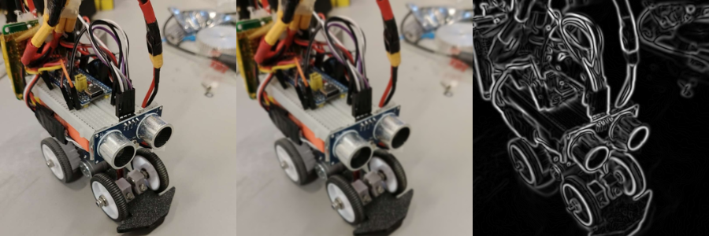

2. During the process, you will also make a simple image recognition program to read a Tic-Tac-Toe board (slightly inspired by the upcoming Robocon 2026)
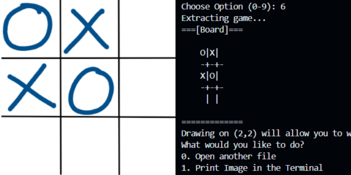

Let's get started, the skeleton code can be downloaded here: [link](TBA)

You can drag and drop the `.zip` file to the left side of the editor (the blue box)

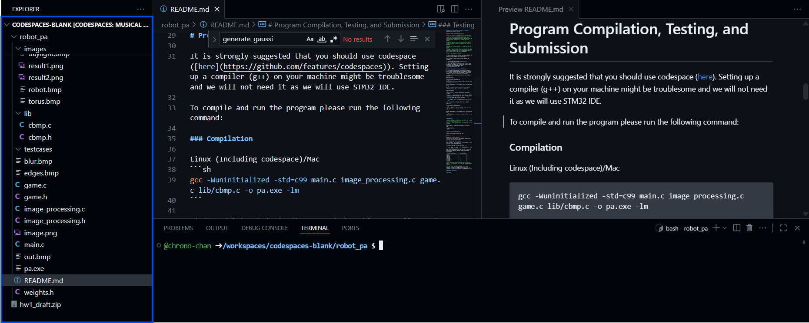

Any commands, are to be written in the terminal (red box as shown below)
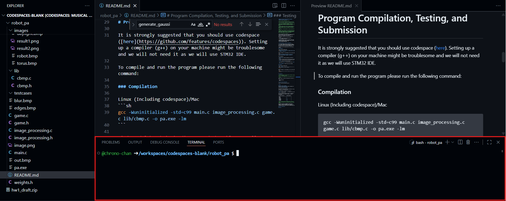

To unzip the zipfile (on codespace):
```sh
unzip skeleton.zip
```

if you are you may use zip tools (usually with UI) on your computer if you want to work on your own computer, but this is discouraged.

Then, **everytime** you open codespace, please change directory (`cd`) to the folder with the project
```sh
cd skeleton 
```

Similar to your computer, if you open the explorer/finder app it by defaults starts at some root directory. You need to open the folder you are working on to actually start working. This is what `cd` is doing.

# Program Compilation, Execution, Testing, and Submission

It is strongly suggested that you should use codespace ([here](https://github.com/features/codespaces)). Setting up a compiler (g++) on your machine might be troublesome and we will not need it as we will use STM32 IDE.

To compile and run the program please run the following command:

### Compilation

Linux (Including codespace)/Mac
```sh
gcc -Wuninitialized -std=c99 main.c image_processing.c game.c lib/cbmp.c -o pa.exe -lm
```

Windows (Although it is discouraged, but if you really need to...)
```sh
gcc -Wl,--stack,64000 -Wuninitialized -std=c99 main.c image_processing.c game.c lib/cbmp.c -o pa.exe -lm
```

Short explanation:

`-Wuninitialized`: prevents forgotting to initialize a variable

`-std=c99`: to make sure that your submission uses the same C standard as the one that we will use to grade your work

`-o pa.exe`: names the resulting executable

`-lm`: includes `math.h` for some functions such as `exp()`, etc.

`-Wl,--stack,64000`: increases stack size on Windows

### Testing
Once compiled, if you would like to test a specific testcase, you may run
```
cat testcases/testcaseX_Y.txt | ./pa.exe
```
to see your output for Task X and Testcase Y

If the output is too long, you may write it to a file
```
cat testcases/testcaseX_Y.txt | ./pa.exe > out.txt
```

You may also right click on files in VSCode to compare it.
Right Click > Select for Compare on your output
Right Click > Compare with Selected on the corresponding output in testcases/outputX_Y.txt

If you are running on codespace, we provided a `grading.py` code for us to grade your final submission. You may run:
```
python grading.py
```
to check the amount of marks you get on the public testcases. However, as the intention is to use it for grading, the error shown might not be very comprehensive.

We are only sure that this script works on codespace.

### Execution

Linux (Including codespace)/Mac:
```sh
ulimit -s 64000 # to increase execution stack size (it is fine to do this only once per terminal)
./pa.exe
```

Windows (Although it is discouraged, but if you really need to):
```sh
./pa.exe # because you already increased the stack size in compilation
```


### Submission

> Submission Deadline: 5th October 2025, 23:59 HKT (2 weeks after homework release) 
>
> Late Submission is accepted but ONLY 1 DAY LATE AND -50% PENALTY WILL BE APPLIED
>
> This is a strict deadline and no late submission will be accepted

Please submit to us ONLY the following files, placed in a zip:
```
- image_processing.c
- image_processing.h
- game.c
- game.h
```

Except adding external libraries, you may do any modification to all four submitted files. This means, you may define your own arrays, helper functions, and structs for the tasks.

You should not modify the other files as we will use the version in the skeleton as is to grade your assignment.

# Project Structure Description

```
/images - images for your testing, we use .bmp for simplicity as it is an uncompressed image format
/lib - library to read .bmp files
/testcases - self explanatory
game.c - codes related to playing Tic-Tac-Toe (Your Task)
game.h - corresponding header files
image_processing.c - codes related to image processing (Your Task)
image_processing.h - corresponding header files
main.c - main program entry point
README.md - self explanatory
weights.h - contains weights for CNN
```

# Tasks

### Task 1: Print as ASCIIArt

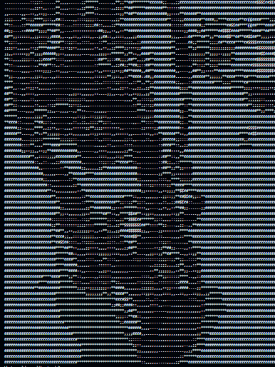

For the first task, we will start simple. Implement the function `asciiprint(Image* image)` in `image_processing.c`

This function does the following:

Each pixel R, G, and B values will be converted to V value according to the following formula:
```
V = floor(0.299 * R + 0.0.587 * G + 0.114 * B)
```
`floor(x)` means the number `x` is rounded down (e.g. floor(3.7) = 3, floor(7.0) = 7)

Then, print **two** characters for each `V` according to the following table (to make the image not squished horizontally)

| V range (inclusive)       | ASCII Character |
| ------------------------- | --------------- |
| 0-31                      | `.`             |
| 32-63                     | `,`             |
| 64-95                     | `:`             |
| 96-127                    | `;`             |
| 128-159                   | `*`             |
| 160-191                   | `#`             |
| 192-223                   | `$`             |
| 224-255                   | `@`             |

> Note: be careful about the looping order, you need to figure it out yourself on how to make the image not appear rotated

This part of the task is intended as a warm up; it may also be helpful for debugging.

### Task 2: Downscaling

> Note: It is indeed not ideal that the image struct is passed by value here instead of pointer.
>
> However, considering that this may be the first time some people work with pointers, I would like to simplify Task 2-6 and allow it to give some people partial marks.
>
> Task 7, however, will give you a simpler exercise to actually understand how pass by pointer works.
>
> You may give it some thoughts, on how you can directly modify the the image if it is passed by pointer. You do need an additional temporary array storage. 

This part, again, is another warm up.

Sometimes, images may be too large in resolution before we print it in the terminal. In this part, we will implement downscaling for images. The implementation should be done in `Image downscale_image(Image image, int downscale)` in `image_processing.c`

Let `k` be the downscaling factor. Imagine that we cover the image with non-overlapping `k` by `k` squares.

For example, if the downscaling factor is 6. Downscaling the image `images/grids.bmp` (with size 12x12) will consider these white-bordered squares:

Note that both width and height of the image will always be divisible by `k` for the testcases.

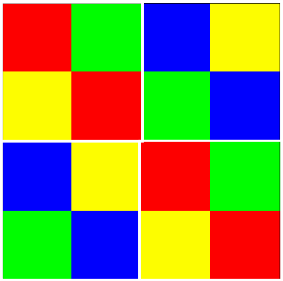

We take the average of the R channel, G channel, and B channel of each squares and make each of them into a pixel of its own.

The downscaled image will look like this:

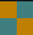

As seen, the upper left corner color looks orange due to the color that forms its average mostly being yellow and red.

A downscaled `images/robot.bmp` looks like this, with `k=8`. It will look like a pixel art~

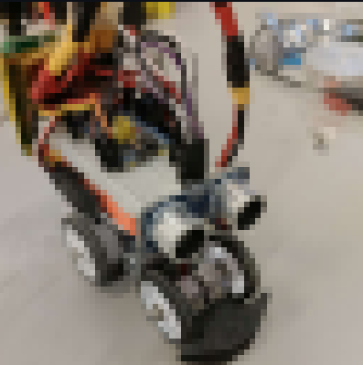

> Hint: 4 for-loops

### Task 3: Convolution and Kernel Generation

For this task, complete `Image convolve_image(Image image, ConvKernel ker)`, `ConvKernel generate_average_kernel(int size)`, and `ConvKernel generate_gaussian_kernel(int r, double sigma)` given in `image_processing.c`

Convolution is a common operation done for image processing.

A convolution kernel is usually a square grid with multiplier values. 

An image has 3 channels (red, green, and blue), but let us first just consider one of them for now. Let's take green for example:

For a convolution kernel with size `k x k`, imagine "dragging" this kernel across the image (on both x and y axis), and then multiply each values on the grid with the value they are on on the image, and then sum them up.


The above image illustrates the scenario when the convolution kernel (as seen on the bottom right) is: 

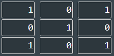

For example, the result (convolved feature) top-left pixel has the value 4 because:

1 × 1 + 1 × 0 + 1 × 1 +

0 × 0 + 1 × 1 + 1 × 0 +

0 × 1 + 0 × 0 + 1 × 1 = 4

For this assignment, the convolution kernel allows the multiplier values to be negative and be a floating point number.

Regarding the color channel of the images, the result of the convolution of the red channel should be the red channel values of the output image, the result of the convolution of the green channel should be the green channel values of the output image, and the result of the convolution of the blue channel should be the blue channel values of the output image. In short, apply the same convolution separately on each channls.

For this function, if the convolution result is a floating point number, round it down so you can return an Image with integer values.

Also note that the size of the image will be `W' x H'` and:
```
H' = H - k + 1
W' = W - k + 1
```
given that `H` and `W` are the original height and width, and the kernel has size `k`

The output of convolution may not always be saveable as the values may not be within the range of 0-255.

But why are we interested in making such an operation? One of the common operation in image processing is blurring. It is a common method to remove noises in images before other tasks such as edge detection, etc.

There are two types of convolution kernels that are commonly be used for blurring.

> Note: If you have learned about convolution before (e.g. from COMP2211), you may assume that the kernel is already flipped for you when passed as the parameter.

> Hint: Hint of Task 2

### Average Kernel

If the given kernel size is `k`, then the kernel will be a `k x k` square, all with values `1/k²`. This is an example with `k=3`

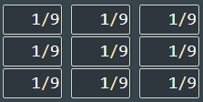

Implement `generate_average_kernel(int size)` to allow making such kernel for any `k`.

### Gaussian Kernel

You may notice that the image produced by average blurring is extremely blurry when k is large. So usually we may still want to assign the center pixel.

Instead of directly giving the parameter `k`. A radius parameter `R` and standard deviation `σ` is given. The size will be `2*R + 1`

The element at `i`-th row and `j`-th column will be assigned the values:

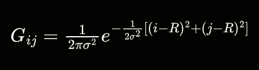

> No need to panic, you can do it! You can always check the debug mode to generate a kernel and check the numbers. Try to break it to smaller terms and make it their own variables if you need to
>
> You may use exp() from math.h and acos(-1) to get the value of pi
>
> Note: careful about data types

An easy way to check that your first steps is correct is that when `i=R` and `j=R` (the center), then the expression reduces to `1/(2πσ²)`

You may check your implementation with this example on [Wikipedia page on Gaussian blur](https://en.wikipedia.org/wiki/Gaussian_blur#Sample_Gaussian_matrix)

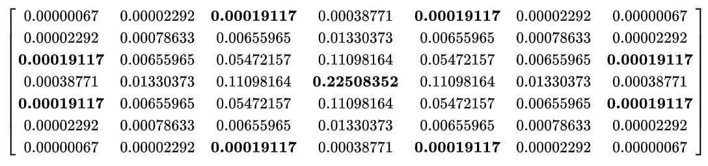

This is when `R=3` (hence the convolution kernel is 7 by 7) and `σ=0.84089642`. (Note that debug mode will round it to 3 decimal places)


Implement `generate_average_kernel(int size)` to allow making such kernel for any `k`.


Here, we can see that the pixels closer to the center are given more weight. Hence gaussian blurring blurs the image but without making it too blurry.


### Task 4: Edge Extraction

For this task complete `Image extract_edges(Image image)` in `image_processing.c`

Another use case of convolution is for extracting edges from images.

To extract edges from images, you need to do the following:
- Convert the image to floating point grayscale values
- Convolve the grayscale image with the following kernel to get a convolved feature Gx (with floating point values)

    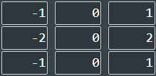
- Convolve the grayscale image with the following kernel to get a convolved feature Gy (with floating point values)

    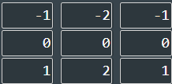
- The size of Gx and Gy should be the same. Create an image G with the same size. To get the value at a certain pixel in G, sum up the square of the value of Gx's pixel and Gy's pixel, then take a square root. Note that `sqrt()` from `math.h` may be used. The values of pixels in G still should be floating point values.

    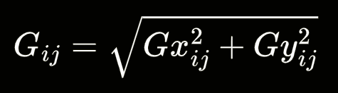 

- Finally, because the value of pixels in G may be out of the range of 0-255 inclusive. We would like to do a normalization using the following formula. Gmin and Gmax is the smallest and the largest pixel values in G respectively. This still should be floating point values.

    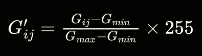

- Round the value obtained above down.

For `robot.bmp`, the following image should be obtained:
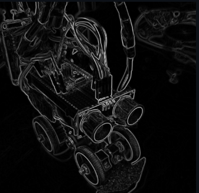

> Hint: How can I keep all that using floating point values? Again, you may define your own structures and helper functions. Although this is not the only way to achieve the intended result...
>
> Note: Floating point precision is important here

### Task 5: Read Tic-Tac-Toe

Firstly pay attention that you are provided with the function `int read_mark(Image image)` in `game.c`. This function might look quite long, but you do not need to do anything about it as long as you implemented convolution correctly.

You only need to implement `Game extract_game(Image image)`.

What it does is, given an 100 x 100 image, that will be converted to grayscale, it can deduce whether it is an X (0), O (1), or empty (2).

The idea behind is a [CNN](https://www.geeksforgeeks.org/machine-learning/introduction-convolution-neural-network/). This basically makes use of the convolution function you have done before.

The idea is, similar to edge detection, convolution may extract visual features in images with some adjusted weightings. We can learn these weights from data through training as done [here](https://colab.research.google.com/drive/1gbY2QG5HNaakA4aWSJYvyinJhD5cUboN?usp=sharing). The weights learned are as seen in `weights.h`. Through convolutions and some matrix multiplications, it can predict shapes.

As the shapes here are simple, we do not need to do a complex training.

Another more traditional approach to image recognition is [Haar Cascade](https://medium.com/analytics-vidhya/haar-cascades-explained-38210e57970d).

Anyway, my intention is to interest you in these topics and hopefully you can apply it on your future robots :D

Your task for now, is simple. The `board.bmp` images provided is a 3 x 3 grid, so you need to cut it into separate 100 x 100 small images. You may create temporary image variables and remember to set the size correctly before passing it into `read_mark`.

Another struct `Game` is also provided, for the corresponding positions, insert the number given from `read_mark` into the `grid` of `Game`. Top left should go to `[0][0]`, top center should go to `[0][1]`, top right should go to `[0][2]`, center left should go to `[1][0]`, and so on...

Return this game struct with suitable symbols.

### Task 6: Report Winning Moves

You need to implement `int report_winning_move(Game game)` in `game.c`

In Tic-Tac-Toe, if you play as O, then winning means having three Os consecutively either vertically, horizontally, or diagonally (from top-left to bottom-right and also top-right to bottom-left)

Assuming that you play as O:
- If there is no move such that you can win in this turn, return `0`
- If there is more than one move (drawing on a different location) such that you can win in this turn, return `10`
- If there is one and only one move such that you can win, and that move is placing the O on the `i`-th row and `j`-th column. Return `3*i + j + 1`, i.e. top-left is represented by `1`, top-center is represented by `2`, top-right is represented by `3`, center-left is represented by `4`, ... 

The given board will not show that the enemy already wins, nor you already win. It is useless to evaluate how to win in such cases.

### Task 7 : Interactive Game of Tic-Tac-Toe

You are required to complete the structure `GameHistory` (in `game.h`) and the function `int play_interactively(GameHistory* game_history)` and `void initialize_game_history(GameHistory* game_history)` (in `game.c`)

You may directly modify `game_history` passed as the argument.

You are given the freedom to define the structure and definition of the function, but it needs to:

- First, explain whose turn it is now (`O` or `X`) and require the user to input two numbers (on one line, separated by a space) corresponding to a cell's location. `X` should always start first.

    ``` 
     0 0 | 0 1 | 0 2
    -----+-----+------
     1 0 | 1 1 | 1 2
    -----+-----+------
     2 0 | 2 1 | 2 2
    ```

    The prompt should be `Please enter your move (O):` or
    `Please enter your move (X):`
- If that cell is already filled or the user inserts something out of range, you need to reject the request to overwrite it and show the prompt again. However, you may assume that the format (i.e. two single-digit positive numbers separated by a space) is always valid.

- Use `print_game` to show the current board's situation after a valid move by the current player regardless of situation
- If any player wins you should print `O wins` or `X wins` followed by a newline. Then a history of the game (print `Game History:` followed by an endline and use `print_game` to print every state we had in this game session starting from the beginning to the end) and return `0` (to break out of the loop). 
- If the game board is full but no player wins, you should print `No one wins` followed by an endline and return `0`
- If none of the above two cases applies, return `1`
- Your implementation should ensure that the loop in `main.c` will continue the game and allow the other player to play

Please refer to line 211-212 of `main.c`. (The part under `case 9:`) this is the code running after the user inputs `9` in the command line.

Please also refer to the testcase output to see an example output.

Please check with the grading script to ensure that there are no minor errors in your output. The grading will be done strictly using the script.


# Grading

Our grading will be done as the following:

We will have additional hidden testcases worth more points other than the given testcases we gave. This is to prevent you from hardcoding your program.

For some questions, we have a special scheme for grading it (for images). They will produce a dump.txt file and we will calculate how much it deviates from our actual solution. If you do think that your answer should be considered correct visually, you may reach out during appeal period for us to visually check the image.

All testcases must be run under 10 seconds. Please be considerate about the amount of for loops you use in the code.

The total mark for this assignment is **100 points**

### Task 1: ASCIIPrint [5 points]
- 2 given testcases (1 points each, 2 points)
- 2 hidden testcases (1.5 points each, 3 points)

### Task 2: Downscaling [15 points]

We will accept some inaccuracies due to floating point arithmetics. For an image with width `W` and height `H`, and your answer at the pixel `(i, j)` for the channel `c` (either red, green, or blue) is `A_ij(c)` while the actual answer is `T_ij(c)` define:

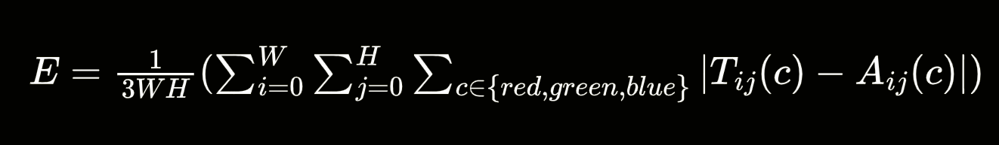
- If E ≤ 2.55 : your answer is accepted with full credit
- If 2.55 < E ≤ 12.75 : your answer is accepted with 75% credit
- Otherwise: your answer is far off, no credit

In simple terms, if on average, your answer is off by ±2.55 per pixel color channel you will still deserve full credit. You do not need to worry if your answer is exactly the same as ours.

- 2 given testcases (1.5 points each, 3 points)
- 3 hidden testcases (4 points each, 12 points)

### Task 3: Convolution and Kernel Generation [25 points]

Kernel Generation will be graded isolated from convolution (so you will still earn credit even if you cannot complete convolution) in the Debug Mode. The kernels accuracy will be checked up to rounding to 3 decimal places.
- 1 given testcase for average kernel (1 point)
- 1 hidden testcase for average kernel (1 points)
- 2 given testcases for gaussian kernel (1 point each, 2 points)
- 3 hidden testcases for gaussian kernel (2 points each, 6 points)

Convolution will be graded based on the result of the images produced by average blurring and gaussian blurring.

We will apply the same penalty credit multiplier for floating point inaccuracies as above.

Testcases:

- 1 given testcase for average blurring (1 point)
- 2 hidden testcases for average blurring (2 points each, 4 points)
- 1 given testcase for gaussian blurring (1 point)
- 3 hidden testcases for (3 points each, 9 points)

### Task 4: Edge Extraction [15 points]

We will apply the same penalty credit multiplier for floating point inaccuracies as above.

Note that for your answers, R, G, B channel should be the same for every pixels.

- 3 given testcases for edge extraction (1 point each, 3 points)
- 3 hidden testcases for edge extraction (4 points each, 12 points)


### Task 5: Extract Game [10 points]

This part will test the correctness of both convolution and slicing of the image

This task will be graded isolated from Task 6 using the Debug Mode

- 2 given testcases for extracting game (1 point each, 2 points)
- 2 hidden testcases for extracting game (4 points each, 8 points)

Note that we will ensure `read_mark` will be able to recognize the correct symbol on the hidden testcases with the correct implementation of convolution.

### Task 6: Report Winning Move [10 points]

This part will also be graded isolated from Task 5 using the Debug Mode

- 2 given testcases for reporting the winning move (1 point each, 2 points)
- 2 hidden testcases for reporting the winning move (2 points each, 8 points)

### Task 7: Interactive Tic-Tac-Toe [20 points]

- 4 given testcases for interactive tic-tac-toe (1 point each, 4 points)
- 4 hidden testcases for reporting the winning move (4 points each, 16 points)


